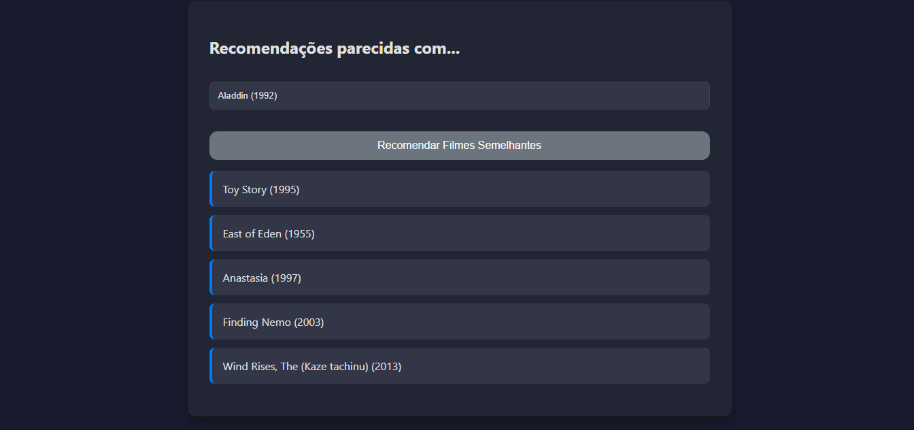
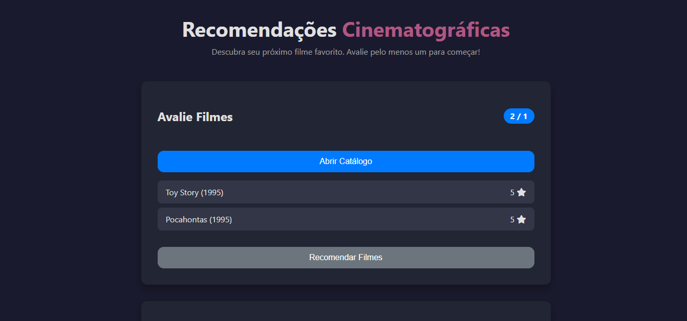

Sistema de recomendação Flask de Filmes baseado no dataset: https://www.kaggle.com/datasets/grouplens/movielens-latest-small.
imagens meramente ilustrativas*

  

  

  

O modelo segue uma arquitetura de Two-Tower Neural Collaborative Filtering, na qual embeddings de usuários e filmes são aprendidos de forma conjunta para prever a nota (rating) do par usuário-filme. Cada filme incorpora ainda uma representação semântica média dos embeddings de seus gêneros, enriquecendo a torre de itens com informações de conteúdo.
O modelo implementa uma arquitetura de Two-Tower Neural Collaborative Filtering (NCF), combinando estratégias de filtragem colaborativa e modelagem baseada em conteúdo em um framework neural unificado. No primeiro tower, o modelo aprende embeddings de usuários a partir de suas interações históricas, capturando padrões latentes de preferência. No segundo tower, ele constrói embeddings enriquecidos de filmes, que combinam informações colaborativas com características de conteúdo, incluindo vetores de gêneros e embeddings semânticos de tags obtidos via SentenceTransformer. As duas torres projetam usuários e filmes em um espaço vetorial compartilhado, onde a similaridade (via produto escalar ou cosseno) reflete a afinidade entre ambos. Essa abordagem híbrida permite ao sistema capturar relações profundas entre usuários e itens, aproveitando simultaneamente o comportamento coletivo e a semântica do conteúdo, resultando em um modelo robusto e expressivo mesmo em cenários de sparsidade ou “cold start”.

Além disso, o sistema incorpora uma seção Item-to-Item, baseada em similaridade vetorial entre embeddings de filmes. Após o treinamento, os embeddings de cada filme são extraídos e normalizados, permitindo o cálculo eficiente da similaridade de cosseno entre eles. O modelo usa essa métrica para identificar os filmes mais próximos em termos de representação latente, retornando recomendações baseadas na proximidade semântica e colaborativa no espaço de embeddings. Essa combinação de Two-Tower NCF com recomendações item-based fornece um sistema híbrido e interpretável, capaz de oferecer sugestões personalizadas, coerentes e semanticamente consistentes.
