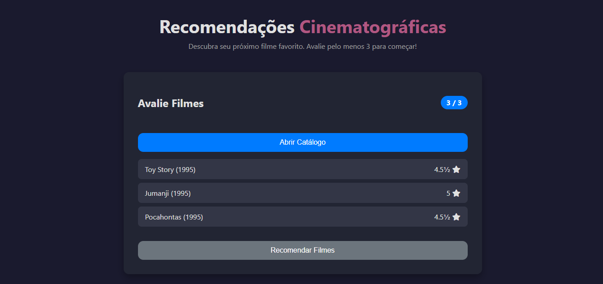
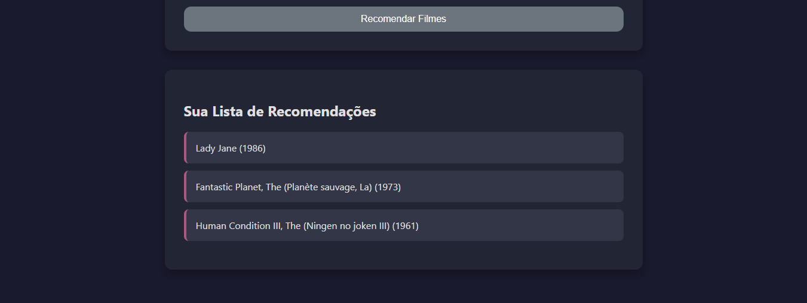

Sistema de recomendação Flask de Filmes baseado no dataset: https://www.kaggle.com/datasets/grouplens/movielens-latest-small.

  

  

O modelo segue uma arquitetura de Two-Tower Neural Collaborative Filtering, na qual embeddings de usuários e filmes são aprendidos de forma conjunta para prever a nota (rating) do par usuário-filme. Cada filme incorpora ainda uma representação semântica média dos embeddings de seus gêneros, enriquecendo a torre de itens com informações de conteúdo.
